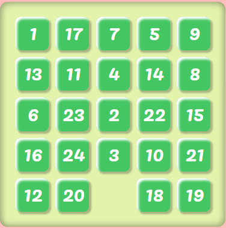
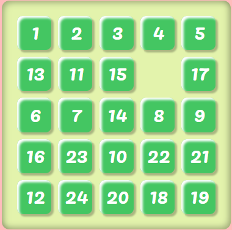
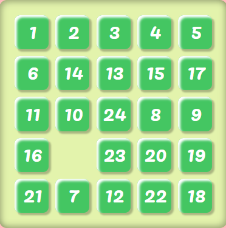
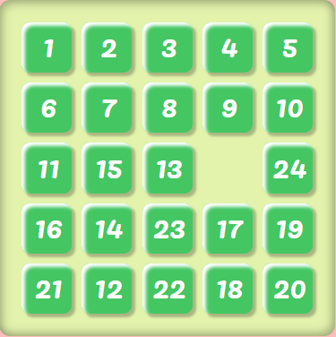
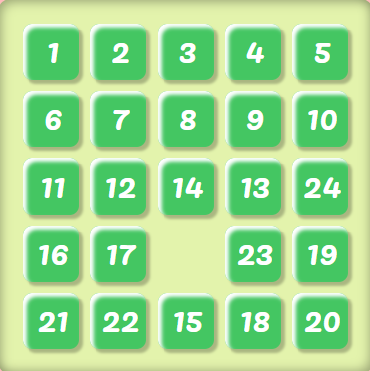
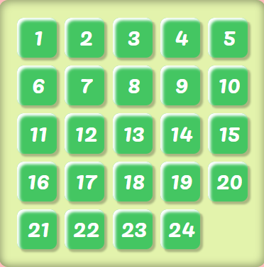
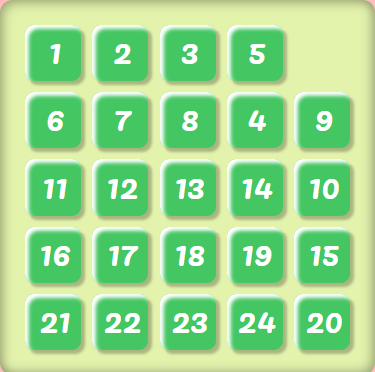
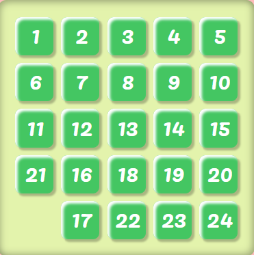
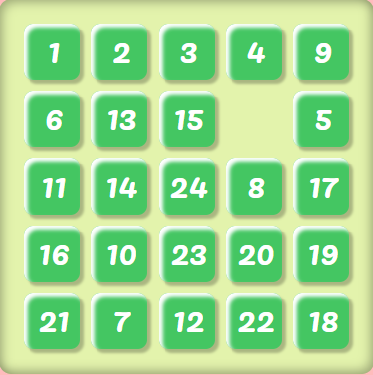
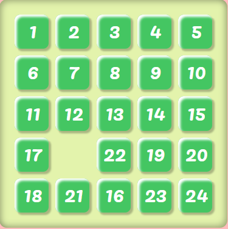

# Sliding Puzzle

The sliding puzzle game and solver with various algorithms.

The app is hosted at [https://rexcheng1997.github.io/sliding-puzzle](https://rexcheng1997.github.io/sliding-puzzle).

## Supported Puzzle Types

- [N puzzle](https://en.wikipedia.org/wiki/15_puzzle): An `m x n` puzzle with m rows and n columns. If you can move the tiles so that the numbers on them are arranged sequentially in rows with the bottom right corner as an empty tile, you have then successfully solved the puzzle.

    Taking a `3 x 3` puzzle as example, your goal is to arrange the tiles to reach the following state:  
    |   1   |   2   |   3   |
    | :---- | :---- | :---- |
    | **4** | **5** | **6** |
    | **7** | **8** |       |

- [Klotski](https://en.wikipedia.org/wiki/Klotski) - Under progress

## Algorithms

In the A\* algorithm family below, Manhattan distance is used as the heuristic function.

- [Static Weighting A*](https://en.wikipedia.org/wiki/A*_search_algorithm#cite_ref-15)  

    

- [Dynamic Weighting A*](https://www.cs.auckland.ac.nz/courses/compsci709s2c/resources/Mike.d/Pohl1973WeightedAStar.pdf)  
    

- [AlphA*](https://web.archive.org/web/20160131214618/http://home1.stofanet.dk/breese/astaralpha-submitted.pdf.gz)  
    

- Greedy

    The idea behind the greedy algorithm is that if we know how to solve a `3 x 3` N puzzle, we can solve an N puzzle with a higher dimension by reducing it down to a `3 x 3` puzzle. In the case of a `4 x 4` N puzzle, we can solve the first row and column greedily, and then apply our standard A* algorithm to solve the remaining `3 x 3` puzzle. Same for `4 x 4`, `4 x 6`, `5 x 5` puzzles and so on.

    Below is a detailed explanation of the process of how the greedy algorithm solves a `5 x 5` N puzzle.

    Suppose you are given the following puzzle to solve.

    

    1. Solve the first row. Do not care about all the other tiles.

        

    2. Solve the first column. Do not mess up the order of the first row.

        

    3. Solve the second row without touching the first row and first column solved.

        

    4. Solve the second column without touching the first two rows and first column solved.

        

    5. Solve the remaining `3 x 3` puzzle as an independent puzzle. Do not touch the rows and columns that are already solved.

        

    ##### Implementation Details

    - How to move a target tile to its desired position?  
        Instead of moving the target tile, move the empty tile. Think of the empty tile as the only tile that can move. Move the empty tile next to the target tile such that when the empty tile and the target tile switch positions, the target tile is closer to its desired position. That is, move the target tile towards its desired position one cell a time by moving the empty tile to that cell first.

    - How to move tiles so that they do not mess up the solved ones?  
        Since we solve the puzzle from top to bottom and left to right in alternate order, it is guaranteed that if we only use the bottom right portion of the puzzle that has not been solved yet as temporary positions that the empty tile can move to, we will not destroy our solved rows and columns.

    - How to move the last two tiles in the row or column to their desired positions since moving one tile will move the other?  
        In the case of solving a row, move the last tile in the row to the second to last position in that row, move the second to last tile below the last tile, move the empty tile to the end of that row, and rotate the `2 x 2` grid containing the last two tiles clockwise.   
        In the case of solving a column, move the last tile in the column to the second to last position in that column, move the second to last tile right to the last tile, move the empty tile to the end of that column, and rotate the `2 x 2` grid containing the last two tiles counter-clockwise.   
        However, there are two edge cases, one for row and the other for column.   In both cases, a sequence of moves called "formula" is needed to resolve the problem. The two edge cases presented here are only in one form. The positions of the tiles can be different in other forms of the edge cases but fortunately, it is always possible to transform other forms of the edge cases into the ones shown above, and then apply the formula to tackle them.

#### Why do we need the greedy algorithm if A* can solve the puzzle in fewer moves?

While A\* can give you the optimal solution or suboptimal solution in the case of different variations of the algorithm, it takes time to find such a solution. If you ask A\* to solve a `10 x 10` N puzzle, even finding the suboptimal solution will take more than an entire afternoon. Although the greedy algorithm will not give you the optimal solution in most cases, and sometimes the solution can be pretty bad in terms of the number of moves required to solve the puzzle, it can find a solution pretty fast, at least much faster than the A\*.

Another issue of A\* is that when the search space becomes very large, there can be too many states in the priority queue to store in the memory. Although a better heuristic and a larger algorithm hyperparameter can help reduce the number of states to store, they cannot alter the fact that the space complexity grows in exponential order.

## Tech Stacks Used

- Typescript
- Sass
- React
- Material-UI
- webpack
